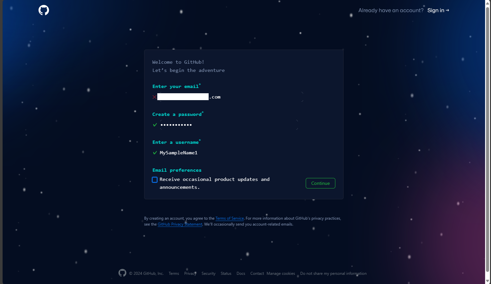

# 超感覚C3講座事前準備(Hack)

## やることリスト
1. GitHubのアカウントを作成しよう

## 1. GitHubのアカウントを作成しよう
1. [こちら](https://github.com/)のリンクからGitHubにアクセス

2. 画面右上の**Sign Up**をクリック

3. 画面の指示に従い，Emailアドレスの入力，パスワード作成，ユーザー名の入力

## 参考
[GitHub公式ドキュメント(アカウント作成)](https://docs.github.com/ja/get-started/start-your-journey/creating-an-account-on-github?source=post_page---------------------------)
